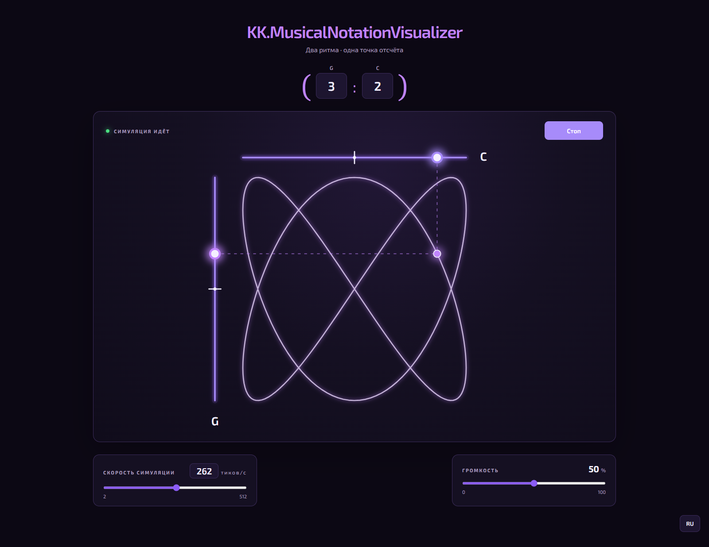

<h1 align="center">KK.MusicalNotationVisualizer</h1>
<p align="center"><strong>Звуковой визуализатор двух ритмов и фигур Лиссажу</strong></p>
<p align="center">
  
  
  
</p>



## Идея

Шарики движутся по горизонтальной оси C и вертикальной оси G. Их проекции задают положение третьего, «теневого» шарика. Его след показывает фигуру Лиссажу, которая меняется вместе с отношением скоростей двух осей.

## Возможности

- отношение `G:C` от `1:1` до `16:16`: первая цифра управляет вертикальной осью G, вторая — горизонтальной C;
- скорость от `2` до `512` тиков в секунду с управлением ползунком или числовым полем;
- звук при прохождении шариков через центральные отметки и регулировка громкости;
- след теневого шарика, сохраняющий один полный цикл фигуры;
- переключение интерфейса между русским и английским языками.

Фигуры при равных числах — окружности. Из-за порядка `G:C` рисунки с разными числами повернуты относительно таблиц, где отношение указано в порядке горизонтальная:вертикальная ось.

## Использование

1. Задайте отношение `G:C` и скорость симуляции.
2. Нажмите **Старт**. Пунктирные линии соединят шарики осей с теневым шариком, а его след постепенно заполнит фигуру.
3. Меняйте отношение, скорость и громкость во время воспроизведения. При изменении отношения шарики плавно переходят к новой фигуре, после чего след строится заново.

Скорость задаёт количество тиков в секунду, темп движения и высоту звука C: `262 тика/с` дают `262 Гц`. Звук G на пять полутонов ниже — около `196 Гц` при той же скорости. При редких прохождениях центра слышны отдельные сигналы; при частоте прохождений от `30` раз в секунду соответствующий тон звучит непрерывно. Частоты ниже `20 Гц` не воспроизводятся, поскольку они не воспринимаются как ноты.

## Запуск из исходного кода

Понадобятся Node.js `20.19+` в ветке 20, `22.12+` в ветке 22 либо `24+`, а также npm. В корне репозитория выполните:

```bash
npm ci
npm start
```

Откройте `http://localhost:4200/`. Для производственной сборки:

```bash
npm run build
```

Готовые файлы находятся в `dist/kk-musical-notation-visualizer/browser/`.

## Лицензии

Лицензия исходного кода проекта пока не указана: файла `LICENSE` в репозитории нет.

### Лицензия стороннего компонента

Шрифт [Exo 2](public/fonts/Exo2-VariableFont_wght.ttf) — © 2013 The Exo 2 Project Authors, распространяется по [SIL Open Font License 1.1](public/fonts/Exo2-OFL.txt). Текст лицензии и уведомление об авторских правах хранятся рядом со шрифтом в `public/fonts/` и включаются в сборку приложения.
